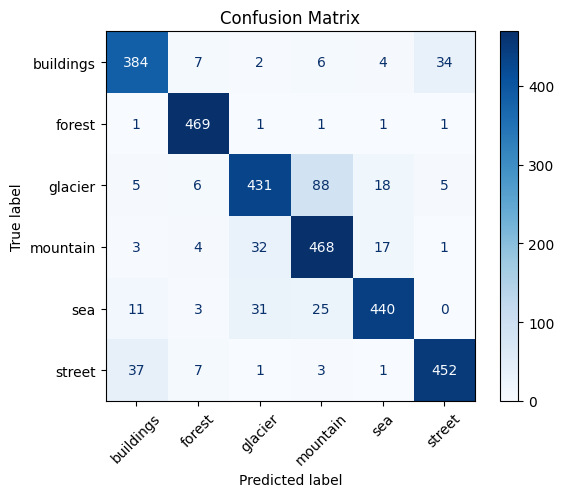
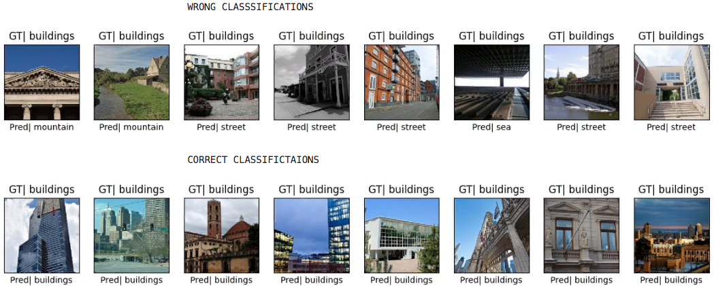

# AlexNet from Scratch on Intel Image Classification Dataset

## Overview

This project implements the **AlexNet** architecture from scratch using TensorFlow and Keras.
The model is trained on the **Intel Image Classification Dataset**, a real-world dataset with
six natural scene categories:

- Buildings  
- Forest  
- Glacier  
- Mountain  
- Sea  
- Street

Despite using best practices such as **data augmentation**, **early stopping**, and **learning rate
scheduling**, training AlexNet proved to be notably challenging. The model showed tendencies to
overfit early, even with aggressive regularization and reduced fully connected layer sizes.
This highlights the complexity and sensitivity of AlexNet, especially when adapting it to new datasets.

---

## Dataset

```bash

The dataset used for training and evaluation is available on **Kaggle**:  
[Intel Image Classification Dataset](https://www.kaggle.com/datasets/puneet6060/intel-image-classification)

It consists of high-resolution RGB images split into training and testing sets across the six scene classes.
```
---

## Project Structure

```bash

alexnet-from-scratch/

    ├── models.py # AlexNet architecture definition
    │ 
    ├── utils.py
    │ ├── image_utils # Image loading and preprocessing utilities
    │ └── plot_utils # Visualization functions
    ├── train.py # Training script
    ├── requirements.txt # Python dependencies
    └── README.md # Project overview
```
---

## Prepare The Dataset

```bash
First download the dataset from Kaggle and place the directories like this:

intel-image-classification/
    ├── seg_train/
    │   └── seg_train/            # Contains training images
    ├── seg_test/
    │   └── seg_test/             # Contains test images

Update the paths in train.py if needed

```
---

## Test Accuracy

```bash

    | Stage                     | Accuracy |
    |---------------------------|----------|
    | Test Before Training      | 10.89%   |
    | Test Set After Training   | 88%      |


These results were achieved using:

    . Batch normalization after each convolutional layer
    . Dropout layers in the fully connected part
    . Smaller dense layers (1024 units instead of original 4096) to reduce overfitting
```
---

---

---

---

## Key Challenges

```bash

Training this AlexNet implementation was particularly difficult, due to:

    . High model capacity (prone to overfitting)
    . Complex interactions between layers and hyperparameters
    . Sensitivity to learning rate and batch size
    . Even with callbacks like EarlyStopping and ReduceLROnPlateau, preventing overfitting
      required multiple rounds of adjustment and validation.
```
---

## Getting Started

### Requirements
```bash
 Install dependencies with:

    pip install -r requirements.txt
```
 ### Running the Demo:
 ```bash
     python train.py

The training pipeline includes:

    . Data augmentation
    . Early stopping (patience=8)
    . ReduceLROnPlateau for adaptive learning rate
    . Performance plots and evaluation metrics
    . Confusion matrix and misclassified samples

```
---

## Highlights

```bash

    . AlexNet Recreated from Scratch: Full implementation of the classic CNN architecture using
      TensorFlow/Keras — no pre-trained layers or external model dependencies.

    . 88% Test Accuracy: Achieved strong generalization on the Intel Image Classification Dataset,
      a multi-class natural scene classification task.

    . Challenging Optimization: Despite using early stopping, learning rate scheduling, data augmentation,
      and dropout, the model remained prone to overfitting, especially in deeper epochs — showcasing
      the intricacies of tuning AlexNet.

    . Optimized Fully Connected Layers: Reduced dense layer sizes from the original 4096 to 1024 neurons
      to balance learning capacity and generalization.
    . Rich Visualization Tools:

        . Confusion matrix
        . Misclassification plots
        . Accuracy/loss trend graphs
    . Data Augmentation Pipeline: Included transformations like rotation, zoom, shift, and horizontal
      flip to enhance robustness and reduce overfitting.

```
---

## Model Structure


Dataset: Intel Image Classification by Puneet Jindal
Architecture: Based on the original AlexNet (Krizhevsky et al., 2012)
```
---

