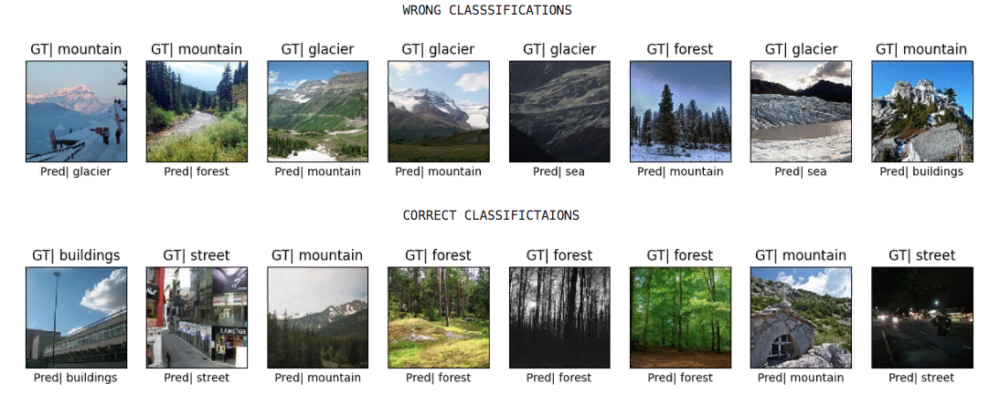

# GoogLeNet-Inspired Inception Model for Intel Image Classification

This project implements a custom version of the **GoogLeNet (Inception v1)** architecture with
**auxiliary classifiers** for improved regularization and training stability. It is trained on
the [Intel Image Classification dataset](https://www.kaggle.com/datasets/puneet6060/intel-image-classification), a natural scene recognition benchmark across 6 real-world categories.

---

## Dataset Overview

- **Source:** [Kaggle: Intel Image Classification](https://www.kaggle.com/datasets/puneet6060/intel-image-classification)  
- **Classes:**  
  `buildings`, `forest`, `glacier`, `mountain`, `sea`, `street`  
- **Input Size:** Resized to `(224, 224)`  
- **Format:** Pre-split into `train/` and `test/` folders
---

## Features

```bash
- Inception v1-style architecture (custom-built using Keras)
- Two **auxiliary outputs** for enhanced training signal
- Augmented training pipeline via `ImageDataGenerator`
- Organized into modular scripts:
  - `model.py`
  - `dataset_generator.py`
  - `utils.py`
- Built-in tools: confusion matrix, training curves, misclassification plots
- Includes `demo.ipynb` notebook for end-to-end training + evaluation
```
---

##  Project Structure

```bash
googlenet-intel-imageClassifier/
    ├── demo.ipynb                  # Main notebook: training + evaluation
    ├── model.py                    # GoogLeNet-style model with aux heads
    ├── utils.py                    # Plotting, generators, helpers
    ├── dataset_generator.py        # Data loaders for train/val/test sets
    ├── desmo_script.py             # To train the model
    └── README.md                   # You're here
    
```
---

## Getting Started

### Requirements

```bash
 Install dependencies with:

    pip install -r requirements.txt
    
```
 ### Running the Demo:
 ```bash
     python demo_script.py
     demo.ipynb

The training pipeline includes:

    . Data augmentation
    . Performance plots and evaluation metrics
    . Confusion matrix and misclassified samples
    
```
---

## Results

```bash
| Metric           | Before Training     | After 30 Epochs     |
|------------------|---------------------|---------------------|
| Total Loss       | 2.8669              | **0.5341**          |
| Main Accuracy    | 18.43%              | **86.57%**          |
| Aux1 Accuracy    | 14.57%              | **87.93%**          |
| Aux2 Accuracy    | 16.60%              | **88.40%**          |

**Conclusion:** The model achieves **~87–88% accuracy** after training, with strong agreement across
  all outputs — a significant improvement from untrained performance.
```
---

## Training Progress Report




---

## Conclusion

```bash

This project demonstrates:

    . How to build a GoogLeNet-inspired deep CNN
    . The use of auxiliary classifiers for deeper supervision
    . How to train and evaluate multi-output models cleanly
    . Clear visual and quantitative evaluation of results

Perfect as a foundation for exploring advanced image classification models.

```
---

