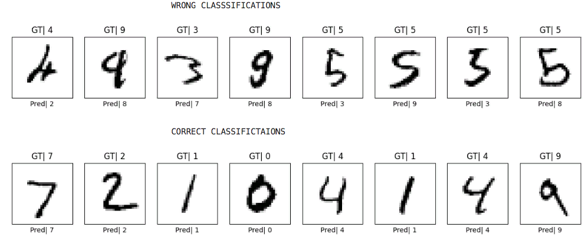

# LeNet-from-Scratch

This repository contains a clean implementation of the classic **LeNet-5** convolutional
neural network architecture built from scratch using TensorFlow/Keras. The model is trained
and evaluated on the **MNIST handwritten digits** dataset.

---

## Project Highlights

```bash

- Implements the original LeNet-5 architecture with `tanh` activations and average pooling
- Preprocesses 28x28 MNIST images by padding to 32x32 to fit the model input
- Trains the model from scratch achieving **98.63% test accuracy**
- Visualizes training curves and prediction results with utility scripts
- Modular and easy to extend for experimentation
```
---

## Test Accuracy

```bash

    | Stage                 | Accuracy |
    |-----------------------|----------|
    | Before Training       | 10.89%   |
    | After Training (10 epochs) | **98.63%** |

```
---

---

---

## Repo Structure

- `lenet.py` — LeNet model architecture
- `mnist_data_loader.py` — Dataset loading and preprocessing functions
- `utils.py` — Plotting utilities for training and predictions
- `demo_script.py` — Complete example to train, evaluate, and visualize results

---

## Model Structure


---

## Getting Started

### Requirements

```bash
- Python 3.7+
- TensorFlow 2.x
- NumPy, Pandas, Matplotlib

 Install dependencies with:

    pip install -r requirements.txt
```
 ### Running the Demo:
 ```bash
     python demo_script.py

This will:

    .Load the Hand written digits-MNIST dataset
    .Train the LeNet model
    .Print test accuracies before and after training
    .Plot training/validation accuracy and loss for the model
    .Display example predictions for the model
    
```
---

## Highlights

```bash

    . Classic LeNet-5 CNN implemented from scratch with TensorFlow/Keras
    . Trained on MNIST digits achieving 98.63% test accuracy after 10 epochs
    . Includes data preprocessing with zero-padding from 28×28 to 32×32
    . Modular code with separate data loader, model, utils, and demo script
    . Visualizes training progress and prediction results for clear insights

```
---
