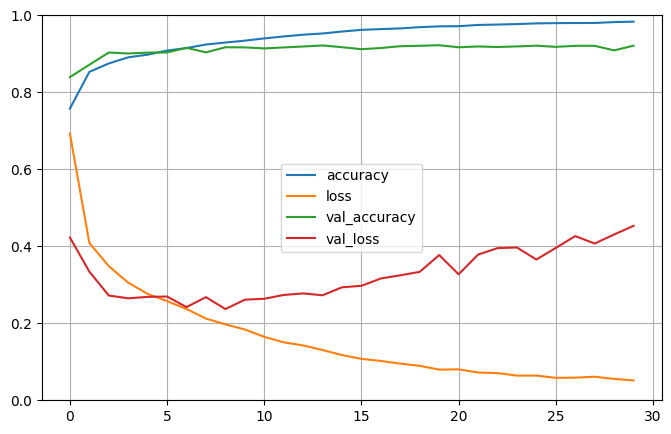
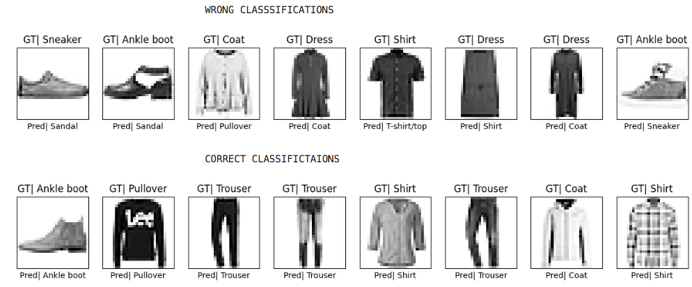

# mlp-vs-cnn-fashion-mnist

This project compares the performance of a **vanilla Multi-Layer Perceptron (MLP)** and a
**Convolutional Neural Network (CNN)** on the Fashion-MNIST dataset.

---

## Project Overview

```bash

Fashion-MNIST is a popular benchmarking dataset consisting of 28x28 grayscale images of 10
fashion categories such as T-shirts, trousers, dresses, and sneakers.

This repository contains:

    - Modular model implementations for MLP and CNN (`models/`)
    - Dataset loading utilities (`data/`)
    - Utility functions for visualization (`utils/`)
    - A demo script (`demo_script.py`) to train, evaluate, and compare both models
    - Visualization of training history and sample predictions
```
---

## Project Structure

```bash

    mlp-vs-cnn-fashion-mnist/
        ├── dataset_loader.py           # Load and preprocess Fashion-MNIST
        ├── models.py                   # MLP and CNN model architectures
        ├── utils.py                    # Plotting functions for predictions and histories
        ├── demo_script.py              # All-in-one training & evaluation script
        ├── requirements.txt            # Python dependencies
        ├── README.md                   # Project overview and instructions
        
```
---

## Results Summary

```bash

- The MLP achieves around **87.7%** test accuracy after training.
- The CNN achieves around **91.4%** test accuracy, benefiting from convolutional layers.
- The demo script trains both models sequentially and plots their training curves side-by-side
  for easy comparison.
```
---

---

---

## Getting Started

```bash

### Requirements

- Python 3.7+
- TensorFlow 2.x
- NumPy, Pandas, Matplotlib

 Install dependencies with:

    pip install -r requirements.txt
```
 ### Running the Demo:
 ```bash
     python demo_script.py

This will:

    .Load the Fashion-MNIST dataset
    .Train the MLP and CNN models
    .Print test accuracies before and after training
    .Plot training/validation accuracy and loss for both models
    .Display example predictions for the CNN model
    .Save the trained models to disk

```
---

## Highlights

```bash

    . Comparative study of MLP vs CNN on Fashion-MNIST dataset
    . Clean, modular codebase with reusable components
    . Training, evaluation, and visualization in one script (demo_script.py)
    . Achieves ~87.7% accuracy with MLP and ~91.4% accuracy with CNN
    . Includes sample prediction plots and training history graphs

```
---
