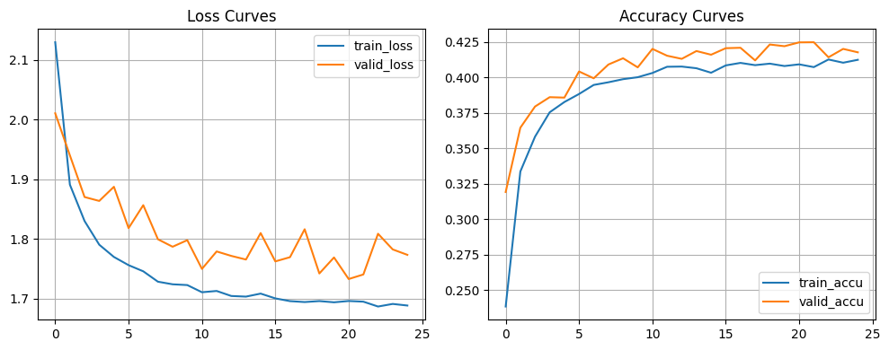
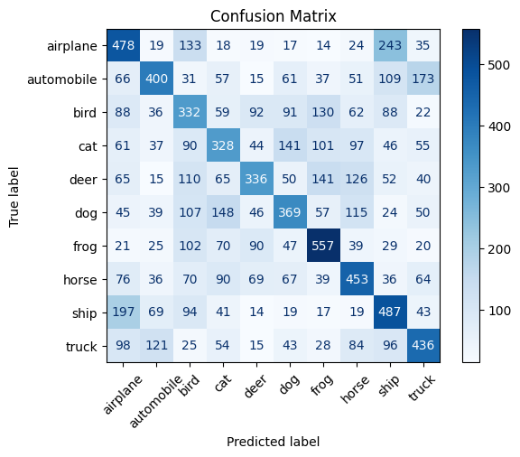
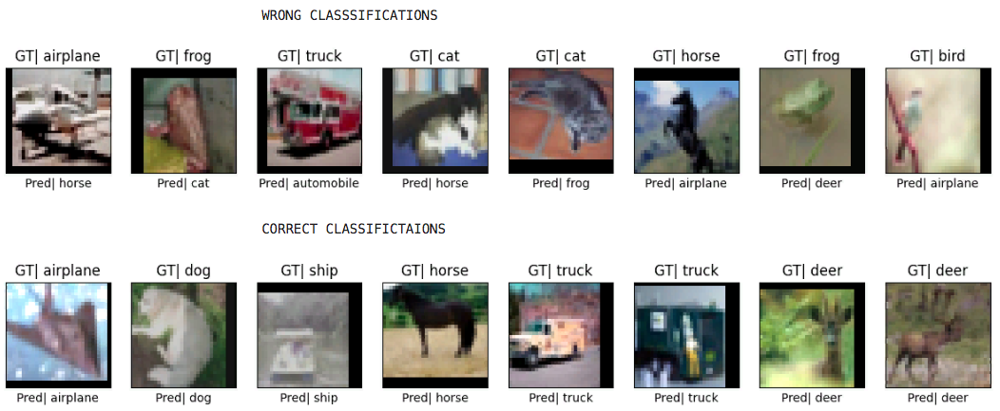
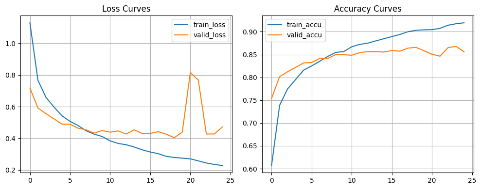
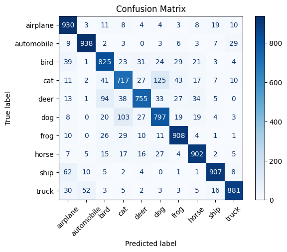
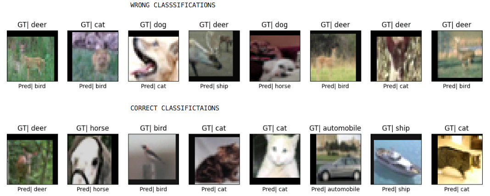

# ResNet Transfer Learning on CIFAR-10

Compare ResNet34 Transfer Learning (Feature Extraction & Fine-Tuning) a gainst a custom
from-scratch PreActResNet34 repo called [→ `resnetx_cifar10`]

---

## Highlights

- Implements two transfer learning approaches using **ResNet34 pretrained on ImageNet**:
  - **Feature Extraction:** Freeze all layers except the classification head.
  - **Fine-Tuning:** Train the entire model end-to-end.
- Compare both against a **scratch-trained PreActResNet34** baseline.
- Visualizations include:
  - Confusion matrix
  - Correct and incorrect predictions
  - Accuracy/loss training curves
- Fully modular and reproducible:
  - `resnet_models.py`: model setup
  - `utils.py`: training and plotting functions
  - `dataloader_generator.py`: dataloader creation
  - `demo_script.py`: CLI runner
  - `demo.ipynb`: interactive notebook

---

## Training Results

```bash
| Model                         | Best Validation Accuracy | Best Validation Loss | Epoch (when achieved) |
|-------------------------------|--------------------------|----------------------|------------------------|
| PreActResNet34 (from scratch) | **89.0%**                | 0.3603               | Epoch 41/50            |
| ResNet34 (Feature Extractor)  | 42.5%                    | 1.7329               | Epoch 21/25            |
| ResNet34 (Fine Tuning)        | 85.9%                    | 0.4311               | Epoch 16/25            |
```
---

## Comparison & Insights


- **Fine-tuned ResNet34** reaches **~85.9% accuracy** in just 25 epochs, showcasing the efficiency of transfer learning.
- **Scratch-trained PreActResNet34** performs slightly better at **~89%**, but requires **50 epochs**, careful tuning, and more compute.
- **Feature extraction-only** ResNet34 underperforms (~42.5%), indicating that fine-tuning the entire network is crucial for CIFAR-10.
- **Conclusion**: Transfer learning dramatically reduces training time while still achieving competitive performance, especially valuable for resource-constrained setups.

---

## Project Structure

```bash

resnet-transfer-learning/
    │
    ├── resnet_models.py        # Model architecture definitions
    ├── utils.py                # Utility functions for training, plotting, etc.
    ├── dataloader_generator.py # Data loaders for CIFAR-10 dataset
    ├── demo_script.py          # Script to run training and evaluation
    ├── demo.ipynb              # Jupyter notebook demonstrating usage and visualization
    ├── requirements.txt        # Python dependencies
    └── README.md               # This file

```
---

---

## Feature Extraction Training Progress Report





---

## Feature Tuning Training Progress Report





---

## Getting Started

### Requirements

```bash
 Install dependencies with:

    pip install -r requirements.txt
    
```
 ### Running the Demo:
 ```bash
     python demo_script.py
     demo.ipynb

The training pipeline includes:

    . Data augmentation
    . Performance plots and evaluation metrics
    . Confusion matrix and misclassified samples
```
---

## Related Work

```bash
resnetx_cifar10 — Custom PreActResNet34 trained from scratch on CIFAR-10.
```
---


