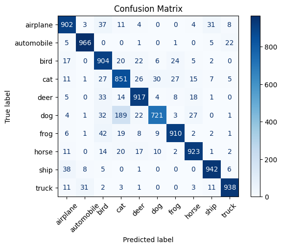
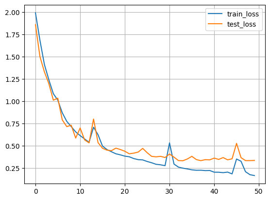
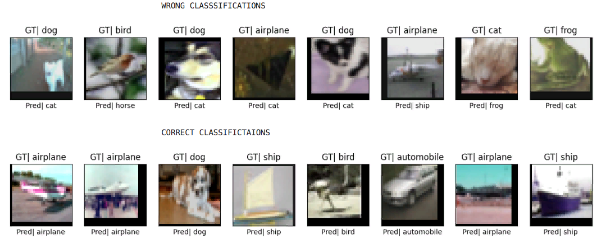

# resnetx_cifar10

```bash
A PyTorch implementation of Pre-activation ResNet architectures trained on CIFAR-10 dataset
```
---
## Overview

```bash
This repository contains clean, modular PyTorch code implementing various Pre-activation ResNet
models (ResNet18, ResNet34, ResNet50, etc.) designed and trained on the CIFAR-10 image classification
benchmark.

The pre-activation design, inspired by He et al., enables improved gradient flow and better training
of deeper ResNets.
```
---

## Features

```bash

    . Modular implementation of Pre-activation ResNet blocks (basic and bottleneck)
    . Supports multiple ResNet variants: 18, 34, 50, 101, 152 layers
    . CIFAR-10 data loaders with augmentation and normalization
    . Training script with progress logs, loss and accuracy tracking
    . Utilities for plotting confusion matrices and prediction examples
    . Jupyter notebook demo for hands-on experimentation and visualization

```
---


## Project Structure

```bash

alexnet-from-scratch/

    ├── models.py                   # ResNet architecture definition
    ├── utils.py                    # Visualization/Helper functions (training, plotting) 
    ├── demo_script.py              # Script to train and evaluate the model
    ├── demo.ipynb                  # Jupyter notebook for demos and visualizations
    ├── dataloader_generator.py     # loades cifar10 from torchvision and generates dataloader
    ├── requirements.txt            # Python dependencies
    └── README.md                   # Project documentation
```
---


## Training Results (50 Epochs)

```bash

    | Epoch | Train Loss | Train Accuracy | Validation Loss | Validation Accuracy |
    | ----- | ---------- | -------------- | --------------- | ------------------- |
    | 1     | 1.9903     | 23.61%         | 1.8583          | 27.48%              |
    | 6     | 1.0107     | 65.15%         | 1.0328          | 65.11%              |
    | 11    | 0.6128     | 79.71%         | 0.6979          | 77.44%              |
    | 16    | 0.4956     | 83.72%         | 0.4709          | 84.72%              |
    | 21    | 0.3824     | 87.61%         | 0.4374          | 85.92%              |
    | 26    | 0.3223     | 89.57%         | 0.4210          | 86.60%              |
    | 31    | 0.5311     | 83.75%         | 0.4060          | 86.84%              |
    | 36    | 0.2287     | 92.59%         | 0.3801          | 88.01%              |
    | 41    | 0.2021     | 93.38%         | 0.3603          | 89.02%              |
    | 46    | 0.3501     | 89.00%         | 0.5256          | 82.91%              |


Note: The model reaches nearly 89% validation accuracy, demonstrating solid generalization on CIFAR-10.
```
---

---

---

---


## Getting Started

### Requirements
```bash
 Install dependencies with:

    pip install -r requirements.txt
    
```
 ### Running the Demo:
 ```bash
     python demo_script.py
     demo.ipynb

The training pipeline includes:

    . Data augmentation
    . Performance plots and evaluation metrics
    . Confusion matrix and misclassified samples

```
---

## Highlights

```bash

    . Clean, modular PyTorch implementation of Pre-activation ResNet models tailored for CIFAR-10
    . Supports ResNet18, 34, 50, 101, and 152 variants with pre-activation blocks
    . Data augmentation pipeline to improve model generalization
    . Comprehensive training and validation workflow with detailed progress logging
    . Visualization utilities for confusion matrix and prediction samples
    . Interactive Jupyter notebook for easy experimentation and insights
    . Achieves ~89% validation accuracy after 50 epochs on CIFAR-10

```
---
